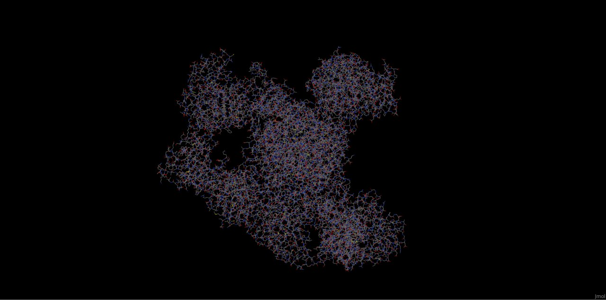
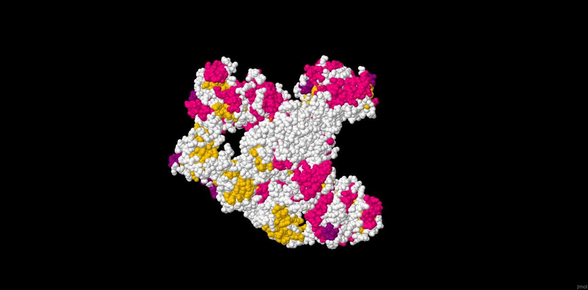
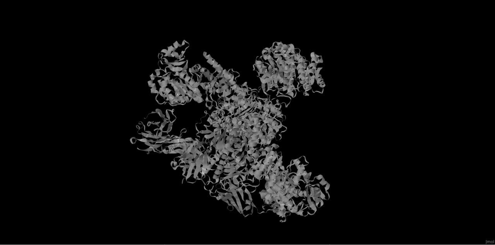
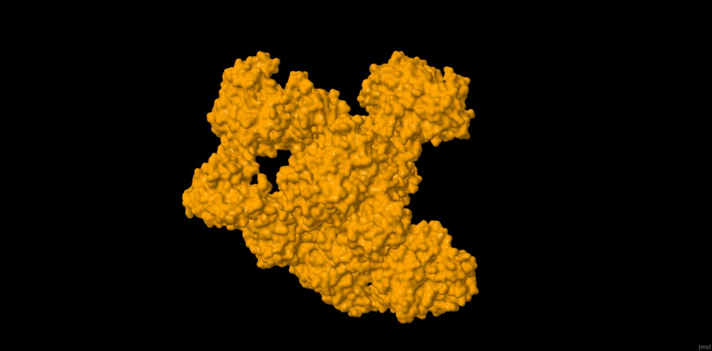
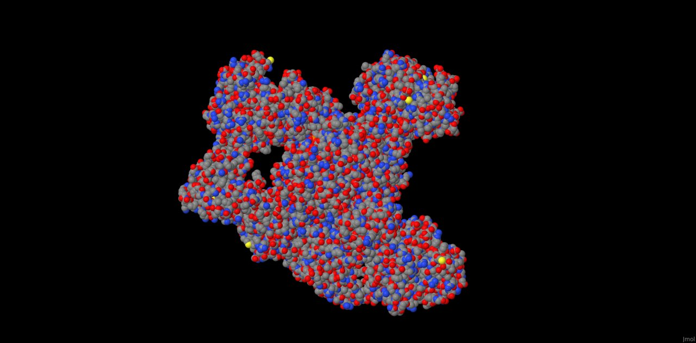
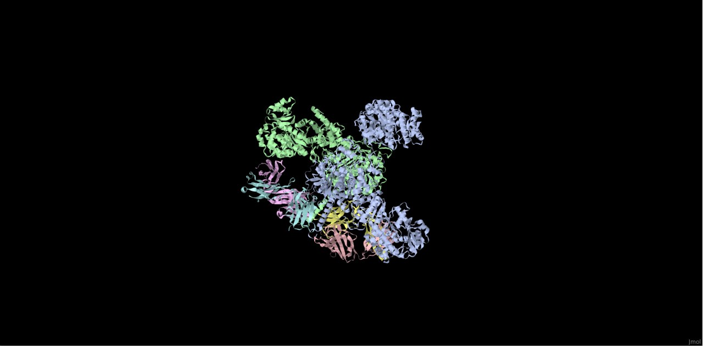
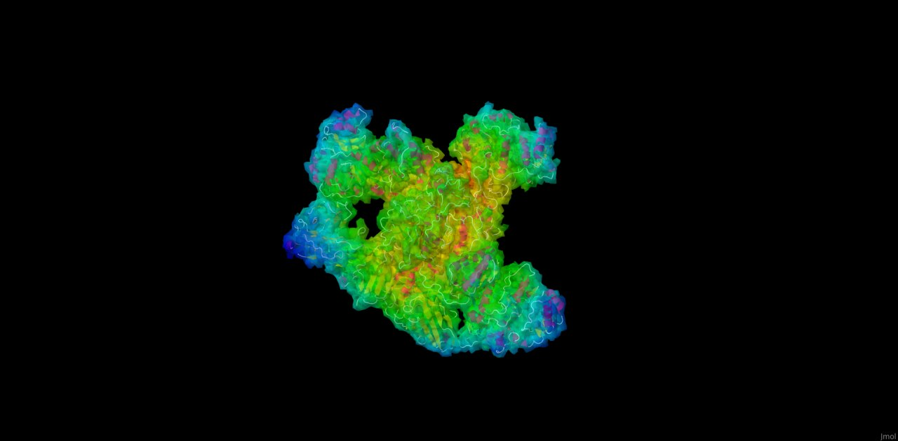

# Assignment 5

- Software: [Jmol](https://jmol.sourceforge.net/)

- Protein: [7M7I](https://www.rcsb.org/structure/7M7I)

## Description:

Jmol is easy to use open-source Java viewer for chemical structures in 3D. The GUI is user-friendly with old style of UI. We can open our pdb-file with open-functionality. Then on the right click we can use different vizualizations and colors by clicking menu items, but there is console in menu items and we can do anuthing from `cmd` :) 

### Wireframe

- command: `wireframe on`  and to turn off - `wireframe off`

- screenshot:

### Backbone

- command: `backbone on`  and to turn off - `backbone off`

- screenshot:

### Spacefill

- command: `spacefill on`  and to turn off - `spacefill off`

- screenshot:

### Ribbons

- command: `ribbons on`  and to turn off - `ribbons off`

- screenshot:

### Molecular surface 

- command: `isosurface molecular on`  and to turn off - `isosurface molecular off`

- screenshot:

### Color model CPK 

- command: `color cpk` 

- screenshot:

### Color model Chains 

- command: `color chain` 

- screenshot:

### Publication quality

- screenshot:

And also I find functionality of spinning (it's awesome)

-GIF:

